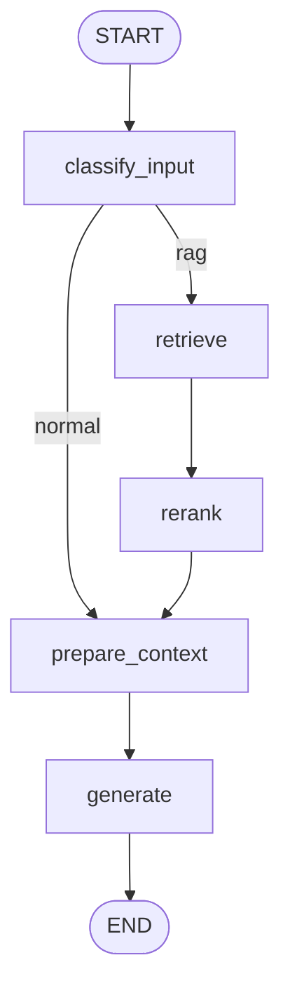

# AskMe RAG

AskMe là dự án hỏi đáp dựa trên dữ liệu nội bộ. Dữ liệu nguồn hiện hỗ trợ `.docx` và `.json`, được tách chunk, nhúng vector, lưu vào Qdrant local, sau đó truy vấn bằng LangChain và điều phối bằng LangGraph.

Hệ thống đang dùng:

- Qdrant local làm vector database.
- Hugging Face/Sentence Transformers cho embedding và reranking.
- Gemini để phân loại đầu vào và sinh câu trả lời.
- Pydantic để ép output có cấu trúc.
- LangSmith để tracing/evaluation khi cần.

Output trả lời có dạng:

```json
{
  "answer": "string",
  "has_enough_context": true,
  "confidence": 0.0,
  "citations": [],
  "missing_info": []
}
```

## Cấu Trúc

```text
.
+-- data/
|   +-- docx/              # Đặt file .docx tại đây
|   +-- json/              # Đặt file .json tại đây
|   +-- evals/             # Bộ câu hỏi/đáp án mẫu để eval bằng LangSmith
+-- scripts/
|   +-- ingest.py          # Nạp dữ liệu vào Qdrant
|   +-- chat.py            # Chat CLI
|   +-- debug_retrieval.py # Chạy riêng retrieve/rerank để debug tài liệu được chọn
|   +-- evaluate.py        # Chạy eval và gửi experiment lên LangSmith
+-- src/
|   +-- askme/
|       +-- config.py      # Cấu hình runtime chính của dự án
|       +-- document_loaders.py
|       +-- embeddings.py
|       +-- graph.py       # LangGraph pipeline
|       +-- llm.py         # Gemini client
|       +-- prompts.py
|       +-- reranker.py
|       +-- schemas.py
|       +-- vectorstore.py
+-- docker-compose.yml     # Qdrant local
+-- .env.example           # Mẫu secrets
+-- requirements.txt
+-- pyproject.toml
```

## Luồng Xử Lý



Ý nghĩa các node:

- `classify_input`: dùng Gemini để phân loại câu hỏi là `normal` hay `rag`.
- `retrieve`: lấy 20 tài liệu/chunk có khả năng liên quan từ Qdrant.
- `rerank`: dùng CrossEncoder để chọn top 5 tài liệu liên quan nhất.
- `prepare_context`: ghép context và cắt theo token budget.
- `generate`: gọi Gemini để sinh JSON answer theo schema Pydantic.

## Cài Đặt

```powershell
python -m venv .venv
.\.venv\Scripts\Activate.ps1
pip install -r requirements.txt
```

## Secrets, LangSmith Và Cấu Hình

Toàn bộ cấu hình runtime nằm trong:

```text
src/askme/config.py
```

File `.env` dùng cho secrets và cấu hình workspace LangSmith local; file này đã được ignore bởi Git. Tạo `.env` từ file mẫu:

```powershell
Copy-Item .env.example .env
```

Sau đó điền:

```env
LANGSMITH_TRACING=false
LANGSMITH_ENDPOINT=https://api.smith.langchain.com
LANGSMITH_PROJECT=askme-rag
LANGSMITH_API_KEY=
GEMINI_API_KEY=
HF_TOKEN=
```

`GEMINI_API_KEY` là key dùng cho Gemini. Code cũng hỗ trợ các tên biến `GOOGLE_API_KEY` và `GOOGLE_GENERATIVE_AI_API_KEY` nếu bạn đã dùng tên đó.

Lưu ý: không đặt các cấu hình runtime như `QDRANT_URL`, `RETRIEVER_TOP_K`, `RERANKER_TOP_K` trong `.env` nữa. Muốn đổi runtime settings thì sửa trực tiếp trong `src/askme/config.py`.

## Chạy Qdrant Local

```powershell
docker compose up -d qdrant
```

Nếu không dùng Docker, hãy chạy Qdrant riêng và sửa `qdrant_url` trong `src/askme/config.py`.

## Cấu Hình Gemini

Cấu hình mặc định trong `src/askme/config.py`:

```python
llm_backend = "gemini"
gemini_model = "gemini-2.5-flash"
gemini_max_input_tokens = 28672
gemini_context_token_budget = 24000
gemini_max_output_tokens = 1024
gemini_temperature = 0.1
```

Lưu ý:

- Nếu muốn đổi model Gemini, sửa `gemini_model`.
- Nếu prompt/context quá dài, giảm `gemini_context_token_budget`.
- Nếu output JSON hay bị cụt, tăng `gemini_max_output_tokens`.
- Nếu muốn câu trả lời ổn định hơn, giữ temperature thấp như `0.1`.

## Retrieval Và Rerank

Cấu hình mặc định:

```python
retriever_top_k = 20
reranker_top_k = 5
enable_reranker = True
debug_reranker = True
```

Nghĩa là Qdrant lấy 20 ứng viên, sau đó CrossEncoder reranker chọn top 5 chunk liên quan nhất để đưa vào prompt.

Nếu thiếu RAM khi load reranker, hệ thống sẽ tự fallback về thứ tự retriever và lấy 5 tài liệu đầu tiên. Có thể tắt reranker trong `config.py`:

```python
enable_reranker = False
```

## Nạp Dữ Liệu

Đặt dữ liệu vào:

- `data/docx/` cho file `.docx`
- `data/pdf/` cho file `.pdf`
- `data/json/` cho file `.json`

Nạp dữ liệu:

```powershell
python scripts/ingest.py
```

Nếu muốn xóa collection cũ rồi index lại từ đầu:

```powershell
python scripts/ingest.py --reset
```

Lưu ý:

- Sau khi đổi `chunk_size`, `chunk_overlap` hoặc dữ liệu nguồn, nên chạy lại `ingest.py --reset`.
- Nếu Qdrant chưa chạy, ingest và chat sẽ lỗi kết nối.

## Chat

```powershell
python scripts/chat.py
```

Khi `debug_input_classification=True`, mỗi câu hỏi sẽ in JSON phân loại đầu vào:

```text
[debug] input_classification: {"route":"rag","reason":"...","confidence":0.96}
```

Khi `debug_reranker=True`, hệ thống cũng in trạng thái reranker đã chạy, bị tắt, hoặc fallback vì lỗi RAM.

## Debug Retriever Và Reranker

Script này chỉ chạy hai bước chọn tài liệu:

```text
retrieve -> rerank
```

Nó không gọi Gemini.

```powershell
python scripts/debug_retrieval.py "Câu hỏi cần kiểm tra"
```

Hoặc chạy rồi nhập câu hỏi:

```powershell
python scripts/debug_retrieval.py
```

Tăng độ dài excerpt:

```powershell
python scripts/debug_retrieval.py "Câu hỏi" --max-chars 500
```

## LangSmith Tracing Và Eval

LangSmith UI chạy trên web tại:

```text
https://smith.langchain.com
```

Để bật tracing/eval:

1. Điền `LANGSMITH_API_KEY` trong `.env`.
2. Đặt `LANGSMITH_TRACING=true` trong `.env`.
3. Nếu dùng region khác, sửa `LANGSMITH_ENDPOINT` trong `.env`.
4. Sửa `LANGSMITH_PROJECT` theo tên project muốn xem trên LangSmith.
5. Sửa `data/evals/qa_examples.json` theo bộ câu hỏi của bạn.
6. Đảm bảo Qdrant đã có dữ liệu bằng `python scripts/ingest.py`.
7. Chạy:

```powershell
python scripts/evaluate.py
```

Evaluator mặc định kiểm tra câu trả lời có chứa các từ/cụm từ trong `must_contain`.

Khi chạy `python scripts/chat.py` với `LANGSMITH_TRACING=true`, mỗi lượt chat sẽ được gửi lên LangSmith với run name `askme_chat`, tags `chat` và `rag`.

## Lưu Ý Vận Hành

- Gemini cần API key hợp lệ trong `.env`.
- CrossEncoder reranker tốn RAM vì dùng PyTorch/Transformers.
- Nếu máy yếu, cân nhắc `enable_reranker=False`.
- Nếu output không parse được JSON, hệ thống sẽ fallback về raw answer với `has_enough_context=False`.
