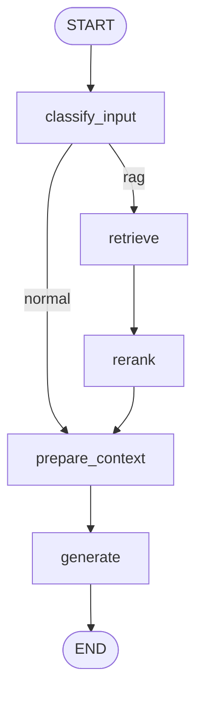

# AskMe RAG

Du an hoi dap bat ky thac mac nao cua nguoi dung dua tren du lieu trong `data/`.
Nguon du lieu ban dau ho tro `.docx` va `.json`, sau do index vao Qdrant local de truy van bang LangChain, dieu phoi reasoning bang LangGraph, va co san LangSmith tracing.
Ket qua tra loi duoc parse bang Pydantic schema de co cau truc gom `answer`, `has_enough_context`, `confidence`, `citations`, va `missing_info`.
Model sinh cau tra loi mac dinh la GGUF local qua `llama-cpp-python`: `E:\LLMs\Vi-Qwen2-7B-RAG.Q2_K.gguf`.

## Cau truc

```text
.
+-- data/
|   +-- docx/              # Dat file .docx tai day
|   +-- json/              # Dat file .json tai day
|   +-- evals/             # Bo cau hoi va dap an mau de LangSmith eval
+-- scripts/
|   +-- ingest.py          # Nap du lieu vao Qdrant
|   +-- chat.py            # Chat CLI voi tri thuc da index
|   +-- evaluate.py        # Chay eval va xem experiment tren LangSmith UI
+-- src/
|   +-- askme/
|       +-- config.py
|       +-- document_loaders.py
|       +-- embeddings.py
|       +-- graph.py
|       +-- llm.py
|       +-- vectorstore.py
|       +-- prompts.py
+-- docker-compose.yml     # Qdrant local
+-- .env.example           # Mau secrets; copy thanh .env tren may local
+-- requirements.txt
+-- pyproject.toml
```

## Luồng xử lý



## Cai dat

```powershell
python -m venv .venv
.\.venv\Scripts\Activate.ps1
pip install -r requirements.txt
```

## Chay Qdrant local

```powershell
docker compose up -d qdrant
```

Neu khong dung Docker, co the chay Qdrant rieng va cap nhat `qdrant_url` trong `src/askme/config.py`.

## Cau hinh

Tat ca runtime settings nam trong `src/askme/config.py`. File `.env` chi dung cho secrets va da duoc ignore boi Git.

Copy mau secrets:

```powershell
Copy-Item .env.example .env
```

GGUF text generation hien dung low-memory profile trong `config.py`:

```python
llm_model_path = Path("E:/LLMs/Vi-Qwen2-7B-RAG.Q2_K.gguf")
llm_n_ctx = 4096
llm_context_fallbacks = "4096"
llm_max_input_tokens = 3072
llm_context_token_budget = 2200
llm_n_batch = 128
```

Neu `pip install -r requirements.txt` gap loi build `llama-cpp-python` tren Windows, cai ban wheel phu hop voi CPU/GPU cua may truoc roi chay lai requirements.

Khi `debug_llm_config=True`, luc model khoi tao se in cac lan thu `llama_cpp_config_attempt`. Neu muon dung context lon, uncomment high-context profile trong `src/askme/config.py` va dam bao may du RAM/KV cache.

## Retrieval va rerank

Mac dinh Qdrant retriever lay 20 ung vien co kha nang lien quan, sau do CrossEncoder reranker chon top 5 doan lien quan nhat de dua vao prompt:

```python
retriever_top_k = 20
reranker_top_k = 5
enable_reranker = True
debug_reranker = True
```

Neu RAM khong du khi load CrossEncoder reranker, he thong se fallback ve thu tu retriever va lay 5 tai lieu dau tien. Co the tat reranker bang `enable_reranker = False` trong `src/askme/config.py`.

## Nap du lieu

Dat file vao:

- `data/docx/` cho `.docx`
- `data/json/` cho `.json`

Sau do chay:

```powershell
python scripts/ingest.py
```

## Hoi dap

```powershell
python scripts/chat.py
```

Bat LangSmith tracing bang cach dien `LANGSMITH_API_KEY` trong `.env` va dat `langsmith_tracing = True` trong `src/askme/config.py`.

## LangSmith eval

LangSmith UI chay tren web tai `https://smith.langchain.com`. Project nay chay eval bang SDK local, sau do ket qua experiment se hien trong UI.

1. Dien `LANGSMITH_API_KEY` trong `.env`.
2. Dat `langsmith_tracing = True` trong `src/askme/config.py`.
3. Sua `data/evals/qa_examples.json` theo bo cau hoi cua ban.
4. Dam bao Qdrant da co du lieu bang `python scripts/ingest.py`.
5. Chay:

```powershell
python scripts/evaluate.py
```

Evaluator mac dinh kiem tra cau tra loi co chua cac tu/cum tu trong `must_contain`.
